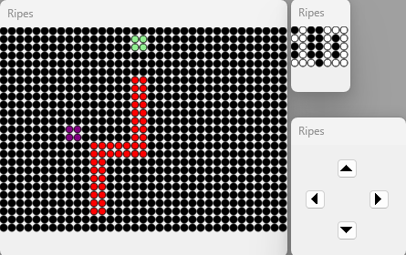

# Ripes-Snake-Game-in-C

This repository contains a Snake game implementation in C, designed to be used with Ripes software. The project showcases the use of cache memory and the integration of input/output systems.

## Input/Output Components:

- **D-Pad:** Used for controlling the snake's movement.
- **Game Board Display:** Utilizes a 25 x 35 LED Matrix to visualize the game environment.
- **Score Display:** Features a 7 x 5 LED Matrix to display the current score.

## How to Use

- Load the C file in ripes, make sure that you have a riscv64 gcc compiler and have configured RISC-V processor as a single-cycle processor.
- Make sure to configure the first matrix (LED_MATRIX_0_BASE) 35 width and 25 height, the second one (LED_MATRIX_1_BASE) 7 width and 5 height.
- For a better experience playing the game, you can adjust the LEDs size in both matrices (I personally recommend a size 16 for both matrices but depends on the screen size).
- For the D-Pad, just make sure its this one: D_PAD_0_UP, D_PAD_0_DOWN, D_PAD_0_LEFT, D_PAD_0_RIGHT.
- After making sure everything is right, compile the code and runit selecting the >> button (not the "green run" one hahaha).

## Contributing

Contributions are welcome! If you have suggestions or improvements, please feel free to fork the repository and submit a pull request.

## Enjoy playing the Snake game while exploring hardware concepts!
